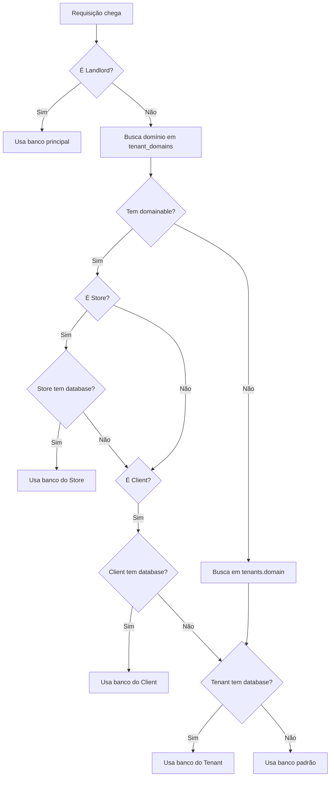

# Arquitetura de Bancos de Dados - Multi-Tenancy

Este documento descreve a arquitetura de bancos de dados do projeto, incluindo a estratégia de multi-tenancy, estrutura de migrations e como o sistema resolve qual banco usar em cada contexto.

---

## Estratégias de Multi-Tenancy Suportadas

O projeto suporta **3 estratégias diferentes** de multi-tenancy, que podem ser usadas simultaneamente:

### 1. **Banco Único (Shared Database)**
- Todos os tenants compartilham o mesmo banco de dados
- Separação por `tenant_id` em cada tabela
- **Quando usar**: Poucos clientes, dados pequenos, simplicidade operacional
- **Configuração**: Nenhum tenant/client/store tem campo `database` preenchido

### 2. **Banco por Cliente (Database per Client)**
- Cada cliente (Client) tem seu próprio banco de dados
- **Quando usar**: Clientes grandes com muitos dados, isolamento de dados por cliente
- **Configuração**: Campo `database` preenchido na tabela `clients`
- **Exemplo**: 
  - Cliente "Bruda" → banco `plannerate_bruda`
  - Cliente "Michelon" → banco `plannerate_michelon`

### 3. **Banco por Loja (Database per Store)**
- Cada loja (Store) tem seu próprio banco de dados
- **Quando usar**: Lojas independentes com gestão separada, máximo isolamento
- **Configuração**: Campo `database` preenchido na tabela `stores`
- **Exemplo**:
  - Loja "Bruda Centro" → banco `plannerate_bruda_centro`
  - Loja "Bruda Sul" → banco `plannerate_bruda_sul`

---

## Estrutura de Migrations

As migrations são organizadas em **2 pastas** com propósitos diferentes:

### 📁 `database/migrations/` - Tabelas Gerais (Landlord)

**Propósito**: Tabelas que existem **apenas no banco principal** (landlord).

**Conteúdo**:
- Gerenciamento multi-tenancy: `tenants`, `tenant_domains`
- Usuários e permissões: `users`, `roles`, `permissions`
- Entidades globais: `clients`, `stores`, `clusters`
- Configurações globais

**Banco**: Sempre no banco configurado em `.env` (ex: `plannerate_staging`)

**Quando roda**:
```bash
php artisan migrate
# ou
php artisan tenant:migrate  # PASSO 1
```

### 📁 `database/migrations/clients/` - Tabelas de Tenant

**Propósito**: Tabelas que existem **em cada banco de tenant** (client/store).

**Conteúdo**:
- Dados operacionais: `planograms`, `gondolas`, `products`
- Dados de vendas: `sales`, `monthly_sales_summaries`
- Workflow (flow): tabelas `flow_*` do pacote laravel-raptor-flow (por cliente)
- Categorias e dimensões específicas do tenant

**Banco**: 
- Se houver banco por client → banco do client
- Se houver banco por store → banco do store
- Senão → banco principal (shared)

**Quando roda**:
```bash
php artisan tenant:migrate  # PASSO 2 (após migrations principais)
```

---

## Hierarquia de Resolução de Banco

O sistema segue uma **hierarquia clara** para determinar qual banco usar:

```
1. STORE (prioridade máxima)
   ↓ se não encontrar
2. CLIENT
   ↓ se não encontrar
3. TENANT
   ↓ se não encontrar
4. PADRÃO (database.default do .env)
```

### Fluxo de Resolução



---

## Componentes Responsáveis

### 1. **TenantResolver** (`AdvancedTenantResolver`)

**Responsabilidade**: Detectar qual tenant está acessando e qual banco usar.

**Localização**: `app/Services/AdvancedTenantResolver.php`

**O que faz**:
- Resolve tenant a partir do domínio
- Busca domainable (Client/Store) associado
- Injeta banco do domainable no tenant
- Chama `storeTenantContext()` com configuração correta

**Métodos principais**:
```php
resolve(Request $request): mixed
detectTenant(Request $request): mixed
injectDomainableDatabase($tenant, ?object $domainData): void
```

### 2. **ResolvedTenantConfig**

**Responsabilidade**: Centralizar configuração do tenant (ID, banco, client, store).

**Localização**: `vendor/callcocam/laravel-raptor/src/Support/ResolvedTenantConfig.php`

**O que contém**:
```php
public Model $tenant;           // Model do tenant
public string $tenantId;        // ID do tenant
public ?string $database;       // Nome do banco dedicado
public ?string $connectionName; // Nome da conexão (geralmente 'tenant')
public ?string $domainableType; // Classe do domainable (Client/Store)
public ?string $domainableId;   // ID do domainable
```

**Métodos úteis**:
```php
hasDedicatedDatabase(): bool  // Se tem banco dedicado
clientId(): ?string           // Retorna ID do client (se domainable for Client)
storeId(): ?string            // Retorna ID do store (se domainable for Store)
toAppConfig(): array          // Configurações para app/config
```

### 3. **TenantDatabaseManager**

**Responsabilidade**: Configurar a conexão de banco dinamicamente.

**Localização**: `vendor/callcocam/laravel-raptor/src/Services/TenantDatabaseManager.php`

**O que faz**:
- Recebe `ResolvedTenantConfig`
- Configura `database.connections.tenant` dinamicamente
- Define qual banco a conexão 'tenant' vai usar

### 4. **UsesTenantDatabase** (Trait)

**Responsabilidade**: Models usam automaticamente a conexão correta.

**Localização**: `vendor/callcocam/laravel-raptor/src/Traits/UsesTenantDatabase.php`

**Como funciona**:
```php
// No model
use UsesTenantDatabase;

// Automaticamente:
public function getConnectionName(): ?string
{
    // Se conexão 'tenant' existe (configurada pelo middleware)
    if (Config::has('database.connections.tenant')) {
        return 'tenant';
    }
    
    // Senão, usa conexão padrão
    return config('database.default');
}
```

**Models que usam**:
- `Planogram`
- `Gondola`
- `Product`
- `Sale`
- `FlowExecution` (pacote flow), etc.
- E todos os outros models de tenant

---

## Configurações no Config

### `config/raptor.php`

```php
'services' => [
    // Resolver customizado para multi-tenancy avançado
    'tenant_resolver' => \App\Services\AdvancedTenantResolver::class,
],

'models' => [
    'tenant' => \Callcocam\LaravelRaptor\Models\Tenant::class,
],

'tenant' => [
    'subdomain_column' => 'domain',  // Coluna para buscar domínio
],

'landlord' => [
    'subdomain' => 'landlord',  // Subdomínio do painel landlord
],
```

---

## Tabelas e suas Localizações

### 🏢 Banco Principal (Landlord)

| Tabela | Descrição | Migration |
|--------|-----------|-----------|
| `tenants` | Tenants do sistema | `database/migrations/` |
| `tenant_domains` | Domínios por tenant (polimórfico) | `database/migrations/` |
| `users` | Usuários do sistema | `database/migrations/` |
| `roles` | Papéis/funções | `database/migrations/` |
| `permissions` | Permissões | `database/migrations/` |
| `clients` | Clientes | `database/migrations/` |
| `stores` | Lojas | `database/migrations/` |
| `clusters` | Clusters de lojas | `database/migrations/` |

### 🏪 Banco de Tenant (Client/Store)

| Tabela | Descrição | Migration |
|--------|-----------|-----------|
| `planograms` | Planogramas | `database/migrations/clients/` |
| `gondolas` | Gôndolas | `database/migrations/clients/` |
| `products` | Produtos | `database/migrations/clients/` |
| `sales` | Vendas | `database/migrations/clients/` |
| `monthly_sales_summaries` | Resumos mensais | `database/migrations/clients/` |
| `flow_configs` | Configurações de workflow (planograma) | pacote laravel-raptor-flow |
| `flow_config_steps` | Etapas da config | pacote laravel-raptor-flow |
| `flow_step_templates` | Templates de etapas | pacote laravel-raptor-flow |
| `flow_executions` | Execuções por gôndola | pacote laravel-raptor-flow |
| `flow_histories` | Histórico de ações | pacote laravel-raptor-flow |
| `categories` | Categorias | `database/migrations/clients/` |
| `dimensions` | Dimensões | `database/migrations/clients/` |

---

## Conexões de Banco

### Conexões Disponíveis

O sistema usa **3 conexões** diferentes:

| Conexão | Uso | Banco |
|---------|-----|-------|
| `landlord` | Models do sistema (User, Role, Client, Store) | Banco principal (do .env) |
| `pgsql` (ou default) | Conexão padrão | Pode ser alterado pelo tenant context |
| `tenant` | Models de tenant (Planogram, Gondola, etc.) | Banco do tenant (client/store) |

### Models de Landlord (Sistema)

**CRÍTICO**: Models que representam dados do sistema (não de tenant) devem **SEMPRE** usar a conexão `landlord`.

**Lista de Models de Landlord**:
- `User`
- `Role`
- `Permission`
- `Tenant`
- `Client`
- `Store`
- `Cluster`

**Implementação**:
```php
// app/Models/User.php
public function getConnectionName(): ?string
{
    $this->ensureLandlordConnection();
    return 'landlord';
}

protected function ensureLandlordConnection(): void
{
    if (!config()->has('database.connections.landlord')) {
        $defaultConnection = env('DB_CONNECTION', 'pgsql');
        $landlordConfig = config("database.connections.{$defaultConnection}");
        $landlordConfig['database'] = env('DB_DATABASE', 'plannerate');
        config(['database.connections.landlord' => $landlordConfig]);
    }
}
```

**Por que isso é necessário?**
- Em contexto tenant, a conexão padrão pode apontar para o banco do tenant
- User, Role, etc. devem SEMPRE buscar no banco principal
- A conexão `landlord` garante isso independente do contexto

### Models de Tenant

Models que representam dados do tenant usam `UsesTenantDatabase` trait:

```php
use Callcocam\LaravelRaptor\Traits\UsesTenantDatabase;

class Planogram extends AbstractModel
{
    use UsesTenantDatabase;
    // ...
}
```

Isso faz o model usar automaticamente a conexão 'tenant' quando configurada.

## Relacionamentos Cross-Database

### Problema

Models de tenant (ex: `Planogram`) precisam referenciar dados do banco principal (ex: `Client`, `Store`).

### Solução Atual

**Accessors manuais** usando `DB::connection('landlord')`:

```php
// Em app/Models/Planogram.php
public function getClientAttribute()
{
    if (!$this->client_id) {
        return null;
    }
    
    return cache()->remember("client:{$this->client_id}", 3600, function () {
        return DB::connection('landlord') // Usa conexão landlord
            ->table('clients')
            ->where('id', $this->client_id)
            ->first();
    });
}
```

**Por que não Eloquent Relationships?**
- Eloquent não suporta relacionamentos entre bancos diferentes
- Query builder permite especificar conexão manualmente
- Sempre use `DB::connection('landlord')` para acessar dados do sistema

---

## Verificações Espalhadas (Para Centralizar)

### Locais com lógica de banco atualmente:

1. **AdvancedTenantResolver**
   - `injectDomainableDatabase()` - busca banco do domainable
   - `configureTenantDatabase()` - aplica configuração de banco

2. **TenantMigrateCommand**
   - `collectClientDatabases()` - busca stores → clients → tenants
   - `migrateClientDatabase()` - aplica migrations em cada banco

3. **SeedWorkflowDataCommand**
   - `configureTenantConnection()` - configura conexão temporária
   - `getDefaultRole()` - busca role em contexto correto

4. **Models individuais**
   - Accessors cross-database (`getClientAttribute`, `getStoreAttribute`, etc.)

### ⚠️ Problema

A lógica de "qual banco usar" está **duplicada** em vários lugares. Mudanças precisam ser feitas em múltiplos arquivos.

---

## Proposta de Centralização

### Criar: `TenantDatabaseResolver`

Um serviço centralizado para **todas** as operações de resolução de banco:

```php
namespace App\Services;

class TenantDatabaseResolver
{
    /**
     * Resolve qual banco usar para um tenant/client/store
     * 
     * Hierarquia: Store > Client > Tenant > Default
     */
    public function resolveDatabaseName(
        ?string $storeId = null,
        ?string $clientId = null,
        ?string $tenantId = null
    ): string;
    
    /**
     * Busca banco por ordem de prioridade
     */
    public function getDatabaseFromHierarchy(
        ?string $storeId = null,
        ?string $clientId = null,
        ?string $tenantId = null
    ): ?string;
    
    /**
     * Lista todos os bancos de tenant do sistema
     */
    public function getAllTenantDatabases(): Collection;
    
    /**
     * Verifica se está em contexto de banco único ou múltiplos
     */
    public function isSharedDatabase(): bool;
    
    /**
     * Retorna estratégia de multi-tenancy em uso
     */
    public function getStrategy(): string; // 'shared', 'per_client', 'per_store', 'mixed'
}
```

### Integrar com ResolvedTenantConfig

```php
// Em ResolvedTenantConfig::from()
public static function from(Model $tenant, ?object $domainData = null): self
{
    // Usar TenantDatabaseResolver para buscar banco
    $resolver = app(TenantDatabaseResolver::class);
    
    $database = $resolver->getDatabaseFromHierarchy(
        storeId: $domainData?->storeId(),
        clientId: $domainData?->clientId(),
        tenantId: $tenant->getKey()
    );
    
    return new self(
        tenant: $tenant,
        tenantId: (string) $tenant->getKey(),
        database: $database,
        // ...
    );
}
```

---

## Comandos Úteis

### Migrations

```bash
# Migra banco principal + todos os bancos de tenant
php artisan tenant:migrate

# Migra apenas banco principal
php artisan migrate

# Migra com --fresh (dropa tudo)
php artisan tenant:migrate --fresh

# Migra e roda seeders
php artisan tenant:migrate --seed
```

### Workflow (Flow) Seeds

```bash
# Popula FlowStepTemplate, FlowConfig, FlowConfigStep e FlowExecution em todos os clientes
php artisan flow:seed

# Apenas um cliente
php artisan flow:seed --client=bruda

# Verificar quantidades por cliente
php artisan workflow:verify
```

### Debug de Conexões

```bash
# Tinker
php artisan tinker

# Verificar conexão atual
DB::connection()->getDatabaseName()

# Verificar conexão tenant
DB::connection('tenant')->getDatabaseName()

# Ver configurações
config('database.connections.tenant')
```

---

## Troubleshooting

### Erro: "relation does not exist"

**Causa**: Model está tentando acessar tabela no banco errado.

**Verificar**:
1. O model usa `UsesTenantDatabase` trait?
2. A conexão 'tenant' está configurada? (`config('database.connections.tenant')`)
3. O banco do tenant tem as migrations rodadas?

**Solução**:
```bash
# Roda migrations nos bancos de tenant
php artisan tenant:migrate
```

### Erro: "Database does not exist"

**Causa**: Banco configurado no client/store não existe.

**Verificar**:
1. Campo `database` está correto na tabela `clients` ou `stores`?
2. O banco foi criado no PostgreSQL?

**Solução**:
```bash
# Criar banco manualmente
psql -U postgres
CREATE DATABASE plannerate_cliente_nome;

# Ou deixar o comando criar automaticamente
php artisan tenant:migrate
```

### Model retorna dados de outro client

**Causa**: Scoping do Landlord não está ativo ou configurado incorretamente.

**Verificar**:
1. Model tem `Landlord::enable()` no construtor?
2. `tenant_id` está sendo aplicado nas queries?
3. O middleware `TenantMiddleware` está rodando?

---

## Referências

- Documentação do Laravel Raptor: `vendor/callcocam/laravel-raptor/README.md`
- Custom Tenant Resolver: `docs/custom-tenant-resolver.md`
- Migrations Multi-Banco: `app/Console/Commands/TenantMigrateCommand.php`

---

## Checklist de Multi-Tenancy

### Para novos models de LANDLORD (sistema):

- [ ] Model representa dados do sistema (User, Role, Client, Store, etc.)
- [ ] **CRÍTICO**: Implementar `getConnectionName()` para usar conexão `landlord`
- [ ] **CRÍTICO**: Implementar `ensureLandlordConnection()` para garantir conexão existe
- [ ] Migration em `database/migrations/` (pasta principal)
- [ ] **NUNCA** adicionar trait `UsesTenantDatabase`
- [ ] Testar que busca dados do banco principal mesmo em contexto tenant

**Template para Models de Landlord**:
```php
public function getConnectionName(): ?string
{
    $this->ensureLandlordConnection();
    return 'landlord';
}

protected function ensureLandlordConnection(): void
{
    if (!config()->has('database.connections.landlord')) {
        $defaultConnection = env('DB_CONNECTION', 'pgsql');
        $landlordConfig = config("database.connections.{$defaultConnection}");
        $landlordConfig['database'] = env('DB_DATABASE', 'plannerate');
        config(['database.connections.landlord' => $landlordConfig]);
    }
}
```

### Para novos models de TENANT:

- [ ] Model representa dados do tenant (Planogram, Gondola, Product, etc.)
- [ ] Adicionar trait `UsesTenantDatabase`
- [ ] Adicionar coluna `tenant_id` na migration
- [ ] Habilitar Landlord no construtor: `static::$landlord->enable()`
- [ ] Criar migration em `database/migrations/clients/` (não na pasta principal)
- [ ] Implementar método `applyDomainContext()` se precisar filtrar por client/store
- [ ] Para relacionamentos cross-database, usar `DB::connection('landlord')`

### Para novas funcionalidades:

- [ ] Verificar em qual banco os dados devem ser salvos (landlord ou tenant)
- [ ] Usar `config('app.current_client_id')` para filtros por client
- [ ] Usar `config('app.current_store_id')` para filtros por store
- [ ] Testar em ambiente com múltiplos bancos
- [ ] Documentar relacionamentos cross-database
- [ ] Models de landlord: usar conexão `landlord`
- [ ] Models de tenant: usar trait `UsesTenantDatabase`

---

**Última atualização**: 2026-02-14
**Versão**: 1.0
